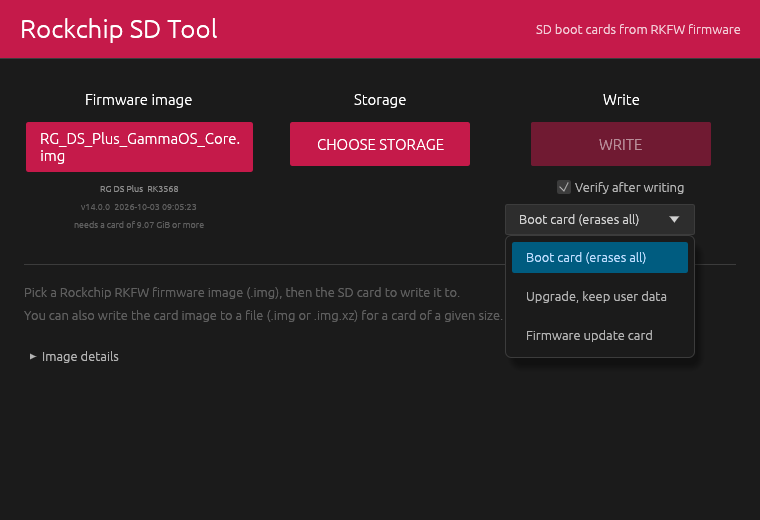
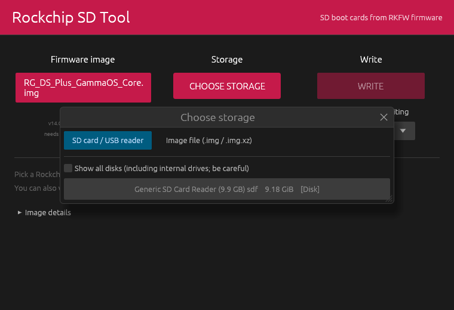
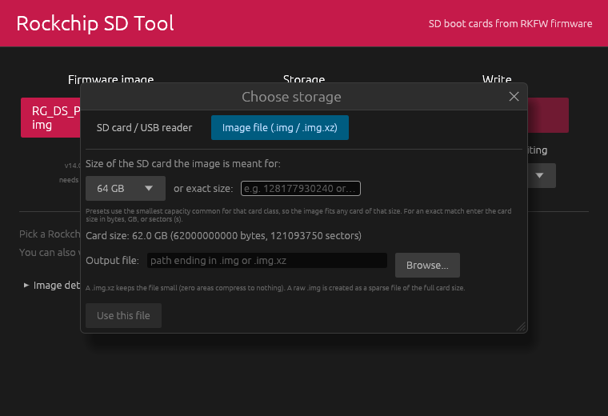
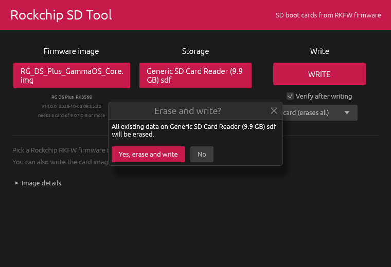
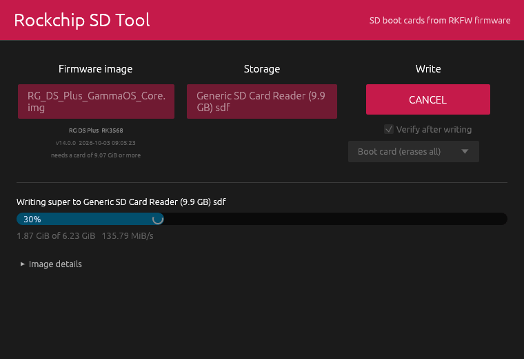
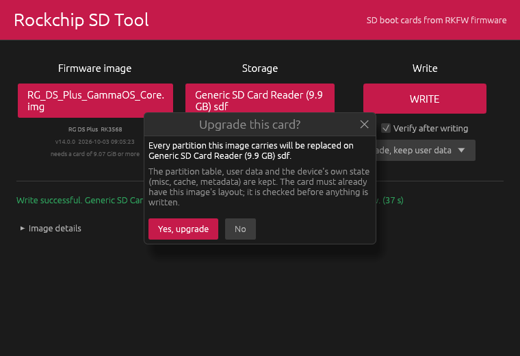
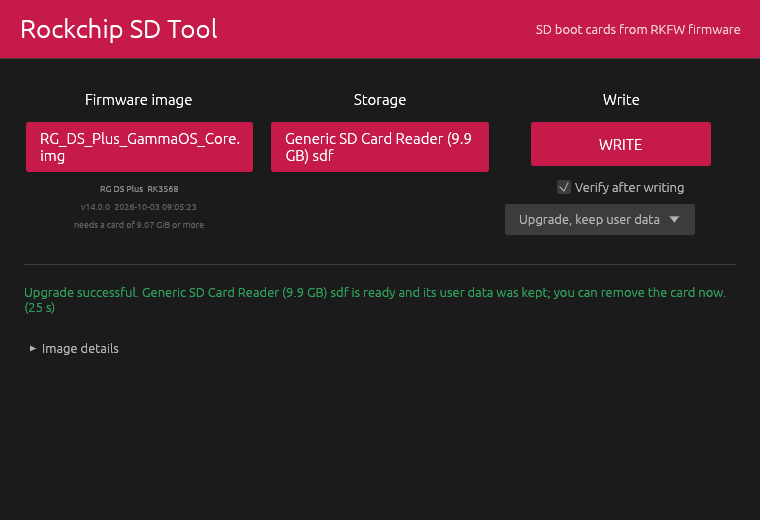
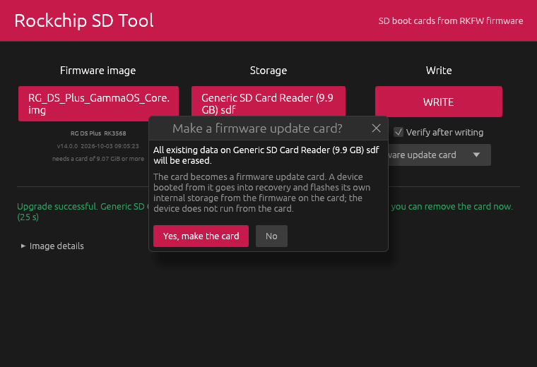
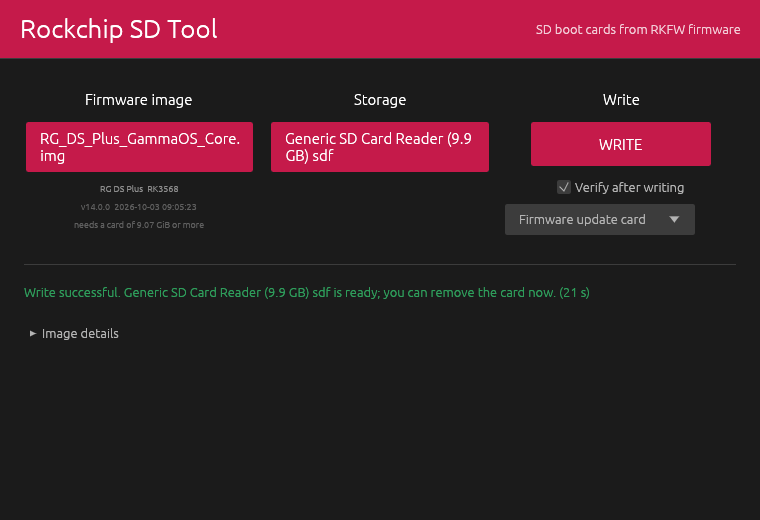

# Rockchip SD Tool

A cross-platform (Windows, macOS, Linux) replacement for Rockchip's Windows-only
SDDiskTool ("SD_Firmware_Tool.exe") in its **SD Boot** mode. It takes a Rockchip
RKFW firmware image (the `update.img` style file made by `rkImageMaker`, for example
`RG_DS_Plus_GammaOS_Core.img`) and turns an SD card into a bootable card with the
same layout SDDiskTool v1.69 produces.

Besides real cards it can write the card image to a plain `.img` or a compressed
`.img.xz` file for an SD card of a given size, which other people can then flash
with any image writer.

The GUI follows the Raspberry Pi Imager flow: choose image, choose storage, write.
A command line interface is included for scripting.


What it does:

* writes the SD Boot layout of an RKFW image to a card, byte for byte what SDDiskTool v1.69
  produces (loader, every partition the image carries, GPT);
* **upgrades** a card that already has that layout without touching the partition table or
  user data, so a firmware update keeps saves and settings;
* makes a **firmware update card**: the device boots from it, goes into recovery and flashes its
  own internal storage from the firmware the card carries, which is Rockchip's "Upgrade Firmware"
  mode;
* writes the same card image to a raw `.img` or a compressed `.img.xz` for a card size you
  choose, instead of to a card;
* reads every block back as it writes it and rewrites the ones that come back wrong, then
  verifies the whole card, because cheap and counterfeit cards are common;
* runs on Windows, macOS and Linux from one small self-contained binary.

## Screenshots

| | |
| --- | --- |
| **Three modes.** A boot card the device runs from, an upgrade that keeps user data, or a card that flashes the device's internal storage. <br>  | **Choose the card.** Only removable disks are listed; the system disk is never selectable. <br>  |
| **Or write to a file.** Pick the size of the card the image is meant for and write a `.img` or `.img.xz`. <br>  | **Confirm.** A full write says plainly that the card will be erased. <br>  |
| **Writing.** Progress per partition, with the speed and the number of blocks that had to be rewritten. <br>  | **Done.** The card is verified before it is released. <br>  |
| **Upgrade instead.** The same button re-flashes the firmware partitions and keeps everything else. <br>  | **Upgrade done.** The partition table and user data are still there. <br>  |
| **Firmware update card.** It carries the firmware as a file for the device to install. <br>  | **Update card done.** Boot the device from it once and it flashes itself. <br>  |

## Download and build

Prebuilt binaries for Windows, macOS (Intel and Apple silicon) and Linux (x86_64 and
aarch64) are produced by the GitHub Actions workflow in this repository (see the
Releases page or the Actions artifacts).

Building from source needs only a Rust toolchain (https://rustup.rs) and a C compiler
(for the bundled xz library):

```
git clone https://github.com/TheGammaSqueeze/rockchip_sd_tool
cd rockchip_sd_tool
cargo build --release
```

The binary is `target/release/rockchip_sd_tool` (`rockchip_sd_tool.exe` on Windows).
It is a single self-contained executable. The macOS release zips also contain
`Rockchip SD Tool.app`, a double-clickable bundle around the same binary; since it is
not notarized, the first launch needs a right-click, Open (or `xattr -dr
com.apple.quarantine "Rockchip SD Tool.app"`).

Linux build dependencies (Debian/Ubuntu): `sudo apt install build-essential libxkbcommon-dev libwayland-dev libgl1-mesa-dev`.
Windows: Visual Studio Build Tools (C++), which rustup installs on request.
macOS: Xcode command line tools (`xcode-select --install`).

## Usage

### GUI

Run `rockchip_sd_tool` with no arguments (double-click the executable). You can also
pass the image path as the only argument, or drag an image file onto the window.

1. **Choose image**: pick the `.img` RKFW firmware. The tool shows the device model,
   chip, version and the minimum card size the layout needs.
2. **Choose storage**: pick the SD card (only removable USB/SD disks are listed;
   internal disks are hidden unless you ask for them and the system disk is never
   selectable). Or switch to *Image file* and write to a `.img` / `.img.xz` for a
   card of a chosen size. See the screenshots above.
3. **Write**. Tick **Upgrade, keep user data** first if you are re-flashing a card that
   already runs this firmware and want to keep what is on it (see below). On Linux you are
   asked for your password (a root helper does the raw disk
   writing); on macOS the system asks for the administrator password to open the disk,
   like Raspberry Pi Imager, and the program itself keeps running as you; on Windows the
   program asks for administrator rights when it starts.

Every block is flushed to the card, read back and compared right after it is
written; a block that reads back wrong is rewritten, up to three attempts, after
which the write fails with the sector number (bad or counterfeit cards). The
"Verify after writing" option adds a second full read-back pass at the end.

### Upgrading a card without losing user data

**Upgrade, keep user data** (`--upgrade` on the command line) re-flashes a card that already
has this layout: the loader and the firmware partitions (`uboot`, `dtbo`, `vbmeta`, `boot`,
`recovery`, `baseparameter`, `super`) are replaced, and everything else is left exactly as it
is. The partition table is not rewritten and nothing is resized.

Apart from clearing the stale boot command described further down, these partitions are
never written by an upgrade, even when the image carries them:
`misc`, `cache`, `metadata`, `frp`, `swap`, `backup` and `userdata`. They hold the state of the
device rather than firmware, and writing them is what a factory flash does:

* `misc` is the bootloader control block. Rockchip firmware ships it with the command
  `boot-recovery` and the recovery argument `--wipe_all`, which is how a freshly written card
  wipes itself on its first boot. Giving that to a card that is already in use erases exactly
  what the upgrade is meant to keep.
* `metadata` holds the keys user data is encrypted with, so replacing it makes the existing user
  data unreadable.

A full write still writes all of them, because that is what makes a new card set itself up.

Before the first byte is written the card's own partition table is read and compared with the
image's parameter file: every partition must be present, at the same sector, with the same size,
except the growing partition (`userdata`), whose size follows the card it was made on. If
anything differs the write is refused and the card is left untouched, with a message naming the
partition that does not match. Write such a card in full instead.

A raw `.img` file can be upgraded in place the same way; a compressed `.img.xz` cannot.

The screenshots above show the confirmation and the result of an upgrade.

### Firmware update cards

**Firmware update card** (`--update-card`) is the other mode Rockchip's own tool offers, for
devices that run from internal storage rather than from the card. The card is not one the device
runs from: you boot the device from it once, it goes into recovery, installs the firmware the card
carries and then runs from its own storage.

Such a card holds two things. The front of it carries the loader and the firmware partitions up to
and including `recovery`, so the device can start and reach recovery, with `misc` set to
"boot-recovery" and "--rk_fwupdate", which is the instruction to install. The rest is an ordinary
FAT32 partition, described by a master boot record, holding the firmware image as `sdupdate.img`
together with `sd_boot_config.config` (which carries `fw_update = 1`) and an empty `rksdfw.tag`.
The partition table the bootloader reads is still a GPT at sector 1, deliberately left without a
protective entry so that an operating system reads the master boot record and sees the data
partition while the bootloader reads the GPT and finds the firmware partitions.

The card therefore has to be big enough for the whole firmware file, which `info` reports. Two
deliberate differences from Rockchip's tool: it formats the data partition as NTFS once the
partition passes 2 GiB, which the recovery on these devices cannot read because its table mounts
that partition as `vfat`, so this tool always makes FAT32; and FAT32 cannot hold a file of 4 GiB
or more, so an image that large is refused with a clear message rather than written unusably.

### Command line

```
rockchip_sd_tool info  <image.img> [--size 128GB] [--md5] [--parameter]
rockchip_sd_tool list  [--all]
rockchip_sd_tool write <image.img> --to /dev/sdX            (Linux, needs sudo)
rockchip_sd_tool write <image.img> --to /dev/rdisk4          (macOS, needs sudo)
rockchip_sd_tool write <image.img> --to \\.\PhysicalDrive2   (Windows, admin prompt)
rockchip_sd_tool write <image.img> --to card.img.xz --size 128GB
rockchip_sd_tool write <image.img> --to card.img --size 250347520s
rockchip_sd_tool write <image.img> --to /dev/sdX --upgrade    (keep the table and user data)
rockchip_sd_tool write <image.img> --to /dev/sdX --update-card (a card that flashes the device)
rockchip_sd_tool verify <image.img> --from /dev/sdX
```

Sizes accept `G`/`GiB` (binary), `GB` (decimal, what card vendors print), plain bytes,
or `s` for 512-byte sectors (`blockdev --getsz`, `diskutil info`, or Disk Management
give the exact card size). A `.img` is written as a sparse file of the full card size.
A `.img.xz` is a normal single-stream xz file (`xz -dc card.img.xz | dd of=/dev/sdX`
or any imager that reads xz works); it is written block by block, the compressed form
of an all-zero block is reused for every zero block, so a 128 GB card image takes about
as long as compressing the firmware itself, and the block index lets `verify` and the
post-write verification seek instead of decoding the whole file.

Flags: `--upgrade` keeps the partition table and user data, `--update-card` makes a firmware
update card instead of a boot card, `--no-verify` skips the
final full verification pass, `--no-block-verify` skips the per-block read-back,
`--yes` skips the confirmation for devices,
`--xz-level N` sets the xz preset (default 3). On Linux the `write` command needs
`sudo` for a device; on macOS it asks for the administrator password itself.

## What gets written (the SDDiskTool SD Boot layout)

The layout was reverse-engineered from SDDiskTool v1.69 and checked byte for byte
against a card it produced (an RG DS Plus running from that card).

| Where (512-byte sectors) | Content |
| --- | --- |
| 0..2 | zeroed first ("Clear MBR"), then the protective MBR |
| 1..34 | primary GPT header and 128 entries |
| 64 | loader: `FlashHead` (RKNS id block header, 4 sectors) |
| 68 | loader: `FlashData` (DDR init), padded to 4 sectors |
| 68 + data | loader: `FlashBoot` (miniloader), padded to 4 sectors |
| partition offsets from `parameter.txt` | every firmware item that has a partition address, in table order; Android sparse images are expanded (the unpacked extent and the last 64 sectors of the partition are zeroed first, DONT_CARE chunks stay zero) |
| start of `metadata`, `cache`, `userdata` | 4 MiB of zeros each, on a full write only (see below) |
| total - 33 | backup GPT entries and header |

A firmware update card is laid out differently; see the section above.

Details that matter for a byte-identical result:

* The loader entries inside the RKFW's `BOOT`/`LDR ` blob are RC4 scrambled with
  Rockchip's fixed key (`7c 4e 03 04 55 05 09 07 2d 2c 7b 38 17 0d 17 11`), the
  keystream restarting every 512 bytes. When the blob's rc4 flag is set the boot
  ROM wants plain data, so each full sector is descrambled; a trailing partial sector
  stays as is.
* The `parameter` item is not written for GPT layouts; the GPT is built from its
  `mtdparts` line.
* `misc` is written with one deliberate change. Rockchip firmware carries the same boot
  command ("boot-recovery", "--wipe_all", which is what makes a freshly written card set
  itself up on its first boot) in two places: offset 0, Google's convention, and 16 KiB,
  Rockchip's older one. The bootloader reads whichever matches the firmware's Android
  version, taken from the boot image header, but Android's recovery only ever clears the
  copy at offset 0. A device whose bootloader reads the 16 KiB copy is sent to recovery on
  every boot while recovery finds no command and waits in its menu, and the card has to be
  rewritten to recover. This tool therefore keeps the command only where this firmware's
  bootloader reads it, by the same rule the bootloader uses, and clears the other copy.
  An upgrade clears the unused copy too, which frees a card that is already stuck, and it
  never writes a command.
* GPT: first usable LBA 34; a `grow` partition ends at `total - 65` on cards of 4 GiB
  and more (`total - 34` below), exactly like SDDiskTool; partition type and unique GUIDs
  are random version 4 UUIDs (a `uuid:name=...` parameter line overrides the unique
  GUID); `:bootable` sets attribute bit 2; the backup header's entry LBA is `total - 33`.
  One deliberate difference: SDDiskTool writes the header's last usable LBA as
  `total - 65` too, which contradicts its own backup entry position; the RG DS Plus
  firmware rewrites it to `total - 34` on first boot and Windows does the same as soon as
  the disk is released. This tool writes `total - 34` from the start, so the header is
  consistent, nothing rewrites it, and the card is byte for byte what the device would
  make of a SDDiskTool card.
* The firmware has no image for `metadata`, `cache` or `userdata`, so a card would otherwise
  keep whatever those sectors held before. Android expects them blank: `metadata` holds the keys
  `userdata` is encrypted with, and the two only work when they are made together. The vendor
  arranges that by asking recovery to wipe on the first boot, which leaves a device that never
  reaches recovery with filesystems it cannot repair. A full write therefore clears the first
  4 MiB of each, so Android makes the filesystems itself whether or not the wipe runs. An
  upgrade leaves them alone, which is how it keeps user data.
* Items over 4 GiB use afptool's extension (high 32 bits of offset and size stored
  behind an `H` marker inside the file name field), which is honoured.

## Tests

`cargo test` builds a small synthetic RKFW image (scrambled loader, sparse super,
several partitions), writes it to a raw `.img` and to a `.img.xz`, reads both back and
checks the loader placement and descrambling, every partition, the sparse expansion,
the primary and backup GPT (CRCs, ranges, attributes, UUID version), the size checks,
cancellation, the per-block verification with retries (fault injection: a flaky block is
rewritten, a permanently bad block fails after three attempts), and the upgrade mode (user data
and the partition table survive, a card with a different layout or no partition table is
refused without being touched). The FAT32 writer used by update cards is checked against
`fsck.vfat` and mtools, which read the volume back and confirm the file names and contents, and a
complete update card is built and its data partition read with `mdir` and `mcopy`.

## Safety

Raw writes destroy everything on the target disk. The disk list hides internal
drives by default and refuses the system disk; all mounted volumes on the chosen
card are unmounted (Windows: locked and dismounted) before writing.
